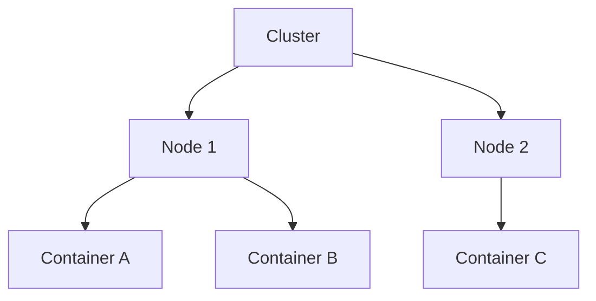

# eHROF 🚀  
**Proactive & Interference-Aware Orchestration for Predictable Real-time Containers**

  

This repository contains a Python-based discrete-event simulation of the **Enhanced Hierarchical Resource Orchestration Framework (eHROF)**, modeling the concepts from the paper:

> **"Proactive and Interference-Aware Hierarchical Orchestration for Predictable Real-time Containers"**  
> *by Seyed Hossein Ahmadpanah, Meghdad Mirabi, Amir Sahafi, Seyed Hossein Erfani.*

## 🌟 Key Features

| Feature | Implementation Status |
|---------|----------------------|
| **Proactive Container/Node Control** | ✅ Predictive adjustments to container resources |
| **Interference-Aware Migration** | ✅ Bully container detection & targeted migration |
| **Hybrid Offline Planning** | ✅ Heuristic + simulated SMT refinement |
| **Multi-Resource Orchestration** | ✅ CPU + Network bandwidth modeling |

## 🏗️ Architecture Overview



### Simulated Components:
- **Resources:** CPU cores, memory, network bandwidth
- **Workloads:** Real-time (periodic tasks) + best-effort containers
- **Controllers:** Cluster, Node, and Container-level logic
- **Interference Model:** LLC misses & memory bandwidth contention

## 🚀 Getting Started

### Prerequisites
- Python 3.7+
- SimPy library

```bash
pip install simpy
```

### Installation & Execution
```bash
git clone https://github.com/ahmadpanah/eHROF.git
cd eHROF
python eHROF.py
```

## ⚙️ Configuration
Edit these parameters in `eHROF.py.py`:

```python
SIMULATION_TIME = 10000     # Simulation duration (ms)
NUM_NODES = 5               # Cluster size
RT_TASK_RATIO = 0.7         # Real-time vs BE containers
INTERFERENCE_FACTOR = 0.3   # Bully impact severity
```

## 📊 Performance Metrics
The simulation outputs:
- Deadline Miss Ratio (DMR)
- Average RT Task Latency
- Migration Count
- CPU Utilization
- Planning Time

## 📚 Implementation Details

| eHROF Concept | Code Location |
|---------------|---------------|
| Hierarchy | `EHROFCluster`, `Node`, `Container` classes |
| Proactive Control | `PredictiveController` class |
| Interference Monitor | `InterferenceMonitor` class |
| Migration Logic | `EHROFCluster.perform_orchestration_logic` |
| Hybrid Planner | `HybridPlanner` class |

## ⚠️ Limitations
- Simplified scheduling model
- Abstracted interference effects
- Static workload assumption
- No real hardware measurements

## 🔮 Future Work
- Enhanced HCBS implementation
- ML-based prediction models
- Dynamic workload simulation
- Multi-resource visualization

<!-- ## 📜 Citation
If using this work, please cite:
```
Ahmadpanah, S. H., et al. "Proactive and Interference-Aware Hierarchical Orchestration for Predictable Real-time Containers." [Journal/Conference], Year.
``` -->

## 📄 License
MIT License - See [LICENSE](LICENSE) file for details.